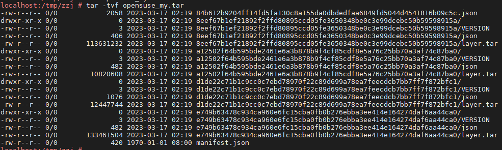
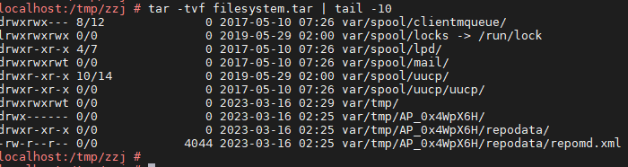

# 常用命令

| 命令                                         | 描述             | 类型 | 备注                                         |
| -------------------------------------------- | ---------------- | ---- | -------------------------------------------- |
| systemctl daemon-reload                      | 重载服务配置     | 服务 |                                              |
| systemctl restart docker                     | 重启docker服务   | 服务 |                                              |
| systemctl enable docker.service             | 开机自启动       | 服务 |                                              |
| docker system info                           | 显示docker信息   | 服务 |                                              |
| docker system df                             | docker磁盘使用率 | 服务 |                                              |
| docker system events                         | 查看docker事件   | 服务 | docker events实时监听；精确到秒得用timestamp |
| docker system events --since="2022-03-12"    | 查看docker事件   | 服务 | date -d @1678562863 时间戳转格式             |
| docker system events --filter image=$imageId | 查看docker事件   | 服务 | date -d "2010-07-20 10:25:30" +%s 转时间戳   |
| docker system prune                          | docker空间清理   | 服务 | 慎用                                         |

| 命令                                           | 描述               | 类型 | 备注                             |
| ---------------------------------------------- | ------------------ | ---- | -------------------------------- |
| docker pull tomcat:10.0.7                      | 从仓库拉取镜像     | 镜像 | 类似git的pull/commit/push        |
| docker images                                  | 查看本地镜像仓库   | 镜像 |                                  |
| docker rmi $imageId                            | 删除本地镜像       | 镜像 | -f --force 强制删除              |
| docker save $iamgeId > image.tar              | 保持镜像至归档文件 | 镜像 | 含镜像历史记录和元数据（含tag）  |
| docker save $iamgeId&#124; gzip > image.tar.gz | 保持镜像至归档文件 | 镜像 | gzip 将归档文件压小一点          |
| docker load < image.tar                        | 导入镜像归档文件   | 镜像 | 含镜像历史记录和元数据（含tag）  |
| docker tag $imageId repo:tag                   | 给镜像打标签       | 镜像 | 创建别名                         |
| docker rmi repo:tag                            | 删除标签           | 镜像 | 如果镜像只有一个标签，则删除镜像 |
| docker build . [-t repo:tag]                   | 构建镜像           | 镜像 | 使用Dockerfile文件构建镜像       |
| docker inspect $imageId                        | 查看镜像元数据     | 镜像 |                                  |
| docker history $imageId                        | 查看镜像构建历史   | 镜像 | --no-trunc显示详细               |
| docker image prune                             | 清理<none>镜像     | 镜像 | 无标签且没被使用的镜像           |

| 命令                                         | 描述                     | 类型 | 备注                                              |
| -------------------------------------------- | ------------------------ | ---- | ------------------------------------------------- |
| docker ps                                    | 查看容器列表             | 容器 | -a 列出所有，包括未运行的                         |
| docker run -itd [--name test] $imageId     | 创建容器，并后台运行     | 容器 | $imageId放最后，--net=host与宿主机共享ip          |
| docker rm $containerId                       | 删除容器                 | 容器 | -f --force 强制删除                               |
| docker kill $containerId                     | 杀掉容器进程             | 容器 | 同stop，容器id还在                                |
| docker exec -it $containerId bash            | 进入容器                 | 容器 | 也可指定容器name进入                              |
| docker exec -it $containerId COMMAND         | 执行容器内的命令         | 容器 |                                                   |
| docker stop/start/restart $containerId       | 启停容器                 | 容器 |                                                   |
| docker attach $containerId                   | 容器前台运行             | 容器 | 同Linux的fg命令                                   |
| docker logs $containerId [--tail 100]       | 查看容器日志             | 容器 | -f 同Linux的tailf                                 |
| docker port $containerId                     | 查看容器的端口映射表     | 容器 | 宿主机netstat也能查看端口，但是看不到是哪个容器的 |
| docker stats $containerId                    | 查看容器资源使用情况     | 容器 | CPU MEM IO                                        |
| docker top $containerId                      | 查看容器进程             | 容器 | PID                                               |
| docker commit $containerId [repo:tag]      | 将容器更改保存至新镜像   | 容器 | -c Dockerfile                                     |
| docker cp $containerId:PATH PATH             | 容器与宿主机之间拷贝文件 | 容器 | 同Linux的scp，可双向                              |
| docker diff $containerId                     | 查看容器里文件结构的更改 | 容器 | 就是对比刚从镜像创建时和当前的文件变化            |
| docker inspect $containerId                  | 查看容器元数据           | 容器 |                                                   |
| docker export $containerId > filesystem.tar | 导出容器文件系统         | 容器 | 保存至归档文件，应用场景：制作基础镜像            |
| docker import filesystem.tar [repo:tag]     | 导入归档文件至新镜像     | 容器 | 和export配套使用                                  |
| docker rename old_name new_name             | 容器重命名               | 容器 |                                                   |

# 设置仓库

`/etc/docker/daemon.json`

```
{
  "registry-mirrors" : [
    "https://pee6w651.mirror.aliyuncs.com",
    "https://dockerhub.azk8s.cn",
    "https://hub-mirror.c.163.com"
  ],
  "insecure-registries" : [
    "192.168.1.7:5000"
  ]
}
```

registry-mirrors 远程仓库拉取地址 pull

insecure-registries 声明非安全(http)私有仓库 push

设置后重启 `systemctl daemon-reload; systemctl restart docker`

## 安装私有仓库

[参考资料] [https://blog.csdn.net/mw5258/article/details/126291484](https://)

### 官方镜像Registry方式（简陋）

`docker pull docker.io/registry` 下载registry镜像

`start_registry.sh` 启动私有仓库容器

```
docker rm registry --force 2>/dev/null
docker run -d -p 5000:5000 --name=registry registry:latest
```

`docker exec -it registry sh` 进入容器

`/etc/docker/registry/config.yml` 配置文件

### docker-distribution方式（简陋）

### Harbor服务器（WEB管理）

### 查看私有仓库

`curl http://192.168.1.7:5000/v2/_catalog`

## 推送镜像

本地镜像标签格式: `服务器IP:端口/镜像名称:版本号`

docker push `服务器IP:端口/镜像名称:版本号`

> The push refers to repository [192.168.1.7:5000/opensuse]
> Get "https://192.168.1.7:5000/v2/": http: server gave HTTP response to HTTPS client
>
> FAQ: /etc/docker/daemon.json设置insecure-registries解决

# 数据管理/挂载目录

[参考资料] [https://michaelyou.github.io/2017/09/17/Docker%E6%95%B0%E6%8D%AE%E7%AE%A1%E7%90%86-Volume%EF%BC%8C-bind-mount%E5%92%8Ctmpfs-mount/](https://)


## volume

挂载到宿主机docker管理的卷路径 `/var/lib/docker/volumes/`

`docker volume create $volumeName` 创建卷

## bind mount

挂载到宿主机任意目录

## tmpfs mount

挂载到宿主机内存

# 网络管理

bridge : 每个容器都独立网卡，且容器间互通

host : 共享宿主机ip，此模式下端口映射被废弃，且宿主机能看到容器内进程

```
localhost:/tmp/zzj # docker network ls
NETWORK ID     NAME      DRIVER    SCOPE
e26ae0795173   bridge    bridge    local
1ae0e00c07e2   host      host      local
1e223ca5e95d   none      null      local

```

# 查看镜像内容

镜像包都是镜像分层的压缩文件



其实我们想看的是镜像文件系统，可以先创建容器，然后导出容器。vim即可查看内容



# 构建镜像

## Dockerfile

docker build 构建镜像专用文件，固定文件名

`docker cp + docker exec + docker commit 也能达到Dockerfile效果，但是效率低，而且需要启动容器（对比效果，以及镜像大小）`

样例：[https://github.com/creack/docker-firefox/blob/master/Dockerfile](https://github.com/creack/docker-firefox/blob/master/Dockerfile)

```
# Firefox over VNC
#
# VERSION               0.1
# DOCKER-VERSION        0.2

from	ubuntu:12.04
# make sure the package repository is up to date
run	echo "deb http://archive.ubuntu.com/ubuntu precise main universe" > /etc/apt/sources.list
run	apt-get update

# Install vnc, xvfb in order to create a 'fake' display and firefox
run	apt-get install -y x11vnc xvfb firefox
run	mkdir /.vnc
# Setup a password
run	x11vnc -storepasswd 1234 ~/.vnc/passwd
# Autostart firefox (might not be the best way to do it, but it does the trick)
run	bash -c 'echo "firefox" >> /.bashrc'
```

## docker build

指定镜像创建容器，执行一系列Dockerfile指令，最后commit保存为镜像。执行完并没有容器保留。

## docker save/load

## docker export/import

## docker commit
